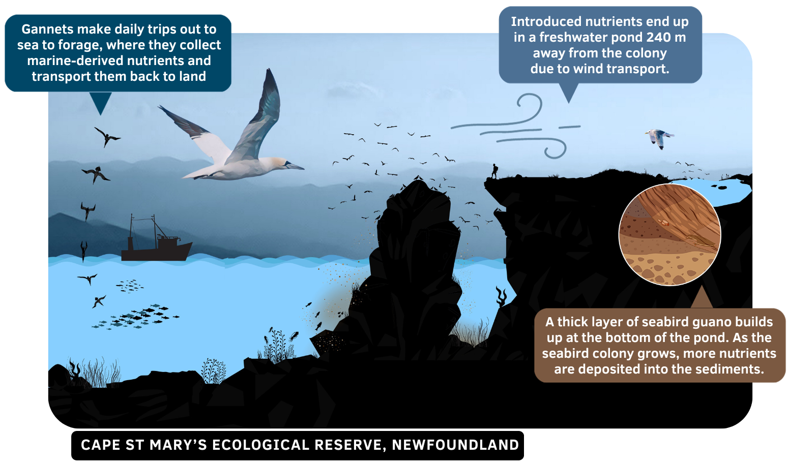

# **INTRODUCTION**

All of the methods and protocols discussed in this analysis review are outlined in Bosch et al. 2023 **[1]**

___


## **A brief project review** {.tabset}

The data used in this analysis is from a project that focuses on the transfer of seabird nutrients from a seabird nesting colony to nearby freshwater ponds **[1]**. View the figure below to understand the ecological processes taking place in my study sites.

```{r, echo=FALSE, fig.cap="Seabird nutrient transfer from Bird Rock, in Cape St. Mary's Ecological Reserve (Newfoundland) to a pond 240 m away from the seabird colony. Seen in the illustration are northern gannets (Morus bassanus) and black-legged kittiwakes (Rissa tridactyla), which both nest within the Reserve on an annual basis"}

```

Using targeted 16S amplicon sequencing, we first assessed the gut microbiome composition of 4 species of seabirds that nest in Newfoundland. Next, we assessed how the bacterial composition of sediments, taken from ponds nearby a colony, are affected by seabird nutrient transfer.

### Study species and sites

Two different types of samples are used in the analysis, including seabird fecal swabs that were collected by an experienced seabird handler according to proper animal care handling techniques, and sediment subsamples that were taken from sediment cores collected from freshwater ponds.

**Seabird fecal swabs = 19 total**

> Collected from 4 species of seabird nesting in Newfoundland:
  * **northern gannets** (*Morus bassanus*)
  * **black-legged kittiwakes** (*Rissa tridactyla*)
  * **common murres** (*Uria aalge*)
  * **atlantic puffins** (*Fratercula arctica*)

**Sediment core subsamples = 12 total**

> Collected from subsamples of sediment cores taken from 3 ponds in Newfoundland:
  * **CSM impacted pond** ~240m upwind of a nesting colony (Bird Rock, Cape St. Mary's (CSM), Newfoundland) made up of gannets, kittiwakes and murres
  * **CSM reference pond** ~2.56 km away from the multispecies colony
  * **Little Fogo Island pond**, another impacted pond, directly adjacent to an atlantic puffin colony

### Sequencing & library prep

The samples were isolated using a DNA isolation kit and PCR amplified using the V4V5 primers (515FB = GTGYCAGCMGCCGCGGTAA,926R = CCGYCAATTYMTTTRAGTTT)**[2] [3]**. Samples were sequenced by the Integrated Microbiome Resource (IMR) - you can learn more about the sequencing and library details from IMR on their (protocols page)[<https://imr.bio/protocols.html>]. A more in depth explanation is provided in the published project **[1]**.


### Files after sequencing

You can download the files used in this analysis here:  
`rawdata-birds.zip` file - 
`rawdata-sediments.zip` file -  

I keep these files in a folder titled `QIIME_files` on my Desktop.

I began with demultiplexed raw sequence data in paired-end .FASTQ format. There are two files for each sample (forwards reads and reverse reads), and 31 samples total, so we have 62 files that are each compressed into GZ format. Each file's name follows a standard naming convention for .FASTQ files, for example the samples for a northern gannet (NOGA), common murre (COMU), and atlantic puffin (ATPU) sample were named as follows:

```         
Forward reads                     |   Reverse reads
NOGA27_S100_L001_R1_001.fastq.gz  |   NOGA27_S100_L001_R2_001.fastq.gz
COMU33_S110_L001_R1_001.fastq.gz  |   COMU33_S100_L001_R2_001.fastq.gz
ATPU05_S111_L001_R1_001.fastq.gz  |   ATPU05_S111_L001_R2_001.fastq.gz
```

Here, the sample NOGA27 is broken down into 5 parts. The sample ID number `NOGA27`, the sample number `S100_`, the lane number `L001_`, the direction of the reads (forward: `R1`, reverse: `R2`), the last segment which will always end with `001`, the file format `.FASTA` or `.FASTQ` depending on the file format (.FASTA contains only reads, .FASTQ contains quality information).

The `.gz` at the end of each file name means the file is compressed with a standard GNU zip (gzip) compression algorithm - there are tools and techniques for working with the compressed files without ever un-compressing them, but in the first section of this analysis we unzip the data files and work with decompressed data. If you don't decompress
data before running an analysis, tools that work with compressed data almost always decompress the data (in memory) anyways before running a task.
___

## **DNA analysis** {.tabset}

For the DNA analysis, we use a variety of tools and software available on the Graham cluster, including QIIME2, a next-generation microbiome bioinformatics suite that offers a free, user-friendly, and open source platform for both advanced and beginner researchers **[4]**. The analysis using QIIME2 is easily run on the Graham cluster hosted by the Alliance. Platforms like QIIME2 are made available through the cluster by loading environment management systems (modules). These modules allow users to access a consistent and controlled environment for executing commands using different programming languages (R, Python, MATLAB, C/C++, Java, FORTRAN, and Julia). For a list of resources used in this tutorial,
refer to Ch-10 (Resources).


### The Graham cluster

The first portion of this tutorial reviews using the Graham cluster hosted by the [Digital Research Alliance of Canada](https://alliancecan.ca/en). Graham is a heterogeneous cluster, suitable for a variety of workloads, and located at the University of Waterloo. The cluster is useful for running jobs that are intensive; jobs are run as a simple text file that contains information about which allocation to run the job on, and let's you specify how many compute nodes the job needs, how much memory the job needs, and how long the job will take to run. Using a computing cluster is also advantageous because you can log-in to their nodes from any computer, store data and make use of their many client support services.

Here are some of the useful Wiki pages hosted by the Alliance that you should read if you are a new user:

> Getting started - <https://docs.alliancecan.ca/wiki/Getting_started>

> the Graham cluster - <https://docs.alliancecan.ca/wiki/Graham>

> System status - <https://status.alliancecan.ca/>

> Running jobs - <https://docs.alliancecan.ca/wiki/Running_jobs>

### Data accessibility

If you are following along as a tutorial, you can download all of the files I used for this analysis through the (Github repo)[https://github.com/johannabosch/QIIME2_for_Graham/tree/main], or you can use your own files and adjust the commands as you go. 


**NOTE:** Download and take a look at my metadata files on the [Github repo](https://github.com/johannabosch/QIIME2_for_Graham), they contain important information about each sample. If you're following along with this analysis, make a folder on your local computer called `QIIME_files` to keep all of the metadata and rawdata files in. This is also where all of your files from the QIIME output will live. Visit this [Q2book](https://gregcaporaso.github.io/q2book/using/metadata.html) to learn more about how to format your metadata files and use them in your analysis.

If you don't have your own raw data to work with, you can download the rawdata file titled `rawdata.zip` for this analysis from this Google drive: https://drive.google.com/drive/folders/1mwfqLjyuLIpHO0KuhRAuxgYXjnbp1iQH?usp=sharing 

___ 

&nbsp;
<hr />
<p style="text-align: center;">Github: [johannabosch](https://github.com/johannabosch) </a></p>
<p style="text-align: center;"><span style="color: #808080;"><em>yohannabosch@gmail.com</em></span></p>

<!-- Add icon library -->
<link rel="stylesheet" href="https://cdnjs.cloudflare.com/ajax/libs/font-awesome/4.7.0/css/font-awesome.min.css">

<!-- Add font awesome icons -->
<p style="text-align: center;">
    <a href="https://www.instagram.com/yohannabosch/" class="fa fa-instagram"></a>
    <a href="https://www.linkedin.com/in/yan-holtz-2477534a/" class="fa fa-linkedin"></a>
    <a href="https://github.com/johannabosch/" class="fa fa-github"></a>
</p>

&nbsp;