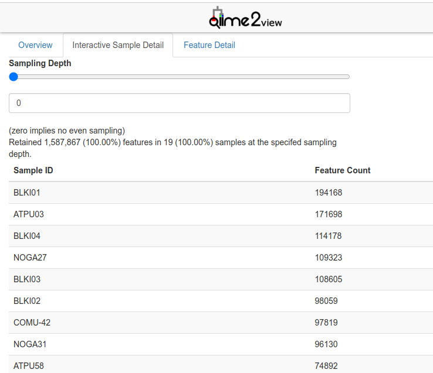

# **DIVERSITY ANALYSES**


## **Build a phylogenetic tree**
While a phylogenetic tree is not technically used to assess diversity within samples, the files generated in this step are used to assess beta-diversity down below.

To generate the trees, I use the QIIME2 plug-in [SEPP](https://www.ncbi.nlm.nih.gov/pmc/articles/PMC5904434//) **[13-16]**. First, acquire the SEPP reference database for 16S data, and store it in the main working directory (`amplicon-analysis`). You can find the latest versions on the [QIIME2 Docs Data Resources page](https://docs.qiime2.org/2023.7/data-resources/)

Instead of downloading the database on your local computer and transferring it to the cluster, just copy the link to the reference database you'd like to use, and then use the `wget` command to download the proper file:

```{r, eval=FALSE}
wget https://data.qiime2.org/2023.7/common/sepp-refs-silva-128.qza
```

Then use the QIIME2 fragment-insertion command with the SEPP reference database to generate the tree:

```{r, eval=FALSE}
#!/bin/bash
#SBATCH --time=
#SBATCH --account=<group-ID>
#SBATCH --mem=

export APPTAINER_BIND=/project/6011879/<user-ID>/:/data
export APPTAINER_WORKDIR=${SLURM_TMPDIR}

module load qiime2/2023.5

#build a tree for seabird fecal samples
qiime fragment-insertion sepp \
 --i-representative-sequences /data/amplicon-analysis/rep-seqs_birds.qza \
 --i-reference-database /data/amplicon-analysis/sepp-refs-silva-128.qza \
 --o-tree /data/amplicon-analysis/asvs-tree_birds.qza \
 --o-placements /data/amplicon-analysis/insertion-placements_birds.qza


#build a tree for sediment samples
qiime fragment-insertion sepp \
 --i-representative-sequences /data/amplicon-analysis/rep-seqs_sediments.qza \
 --i-reference-database /data/amplicon-analysis/sepp-refs-silva-128.qza \
 --o-tree /data/amplicon-analysis/asvs-tree_sediments.qza \
 --o-placements /data/amplicon-analysis/insertion-placements_sediments.qza


#build a tree for the merged feature table
qiime fragment-insertion sepp \
 --i-representative-sequences /data/amplicon-analysis/merged_rep-seqs.qza \
 --i-reference-database /data/amplicon-analysis/sepp-refs-silva-128.qza \
 --o-tree /data/amplicon-analysis/asvs-tree.qza \
 --o-placements /data/amplicon-analysis/insertion-placements.qza

```


## **Generating alpha rarefaction curves**

An alpha rarefaction curve is used for understanding the richness and diversity of microbial communities within a given sample or data set. In the context of microbiome analysis, it provides insights into the number of unique species, known as alpha diversity, at different sampling depths. These curves are generated by repeatedly subsampling the sequencing data at various depths, and measuring diversity metrics (e.g., Shannon or Simpson index) at each step. As the sequencing depth increases, the curve typically plateaus, revealing the point at which additional sequencing data no longer significantly contributes to the detection of new microbial taxa. Alpha rarefaction curves not only help researchers identify optimal sequencing depths but also offer a glimpse into the complex and unique microbial ecosystems present in various environments, making them a fundamental tool in microbiome research.

Start by making a directory called `/diversity` to keep all the files that will be generated in this next section.
```{r, eval=FALSE}
mkdir diversity
```

### Finding max depth

To create an alpha-rarefaction curve, first find out what you want the maximum depth (`--p-max-depth` in the below command) value to be for your data. This might depend on the quality of the data, or your research question. To determine the appropriate value, you should ideally choose a depth that retains a substantial portion of your data set while still ensuring meaningful results. You can start by looking at your filtered feature table to find the maximum sequencing depth present, or you can set it to a value slightly lower to provide a buffer.

I chose maximum depth based on the maximum sequencing depth for both sample types found within the summary files that were generated in the last steps of the Data Preprocessing stage: `filtered_feature-table_birds.qzv` and `filtered_feature-table_sediments.qzv`. When opening these files in [QIIME2 View](https://view.qiime2.org/), this number can be found on the first tab of the visualization file, called `Overview`, or on the `Interactive Sample Detail` page. 

For example, the maximum depth of the bird fecal samples after filtering was 199 289, and the maximum depth for the sediment samples was 33 503.

```{r knitr-logo, out.width='85%', fig.show='hold', echo=FALSE}

```


### Generating the curve

The values found above for the maximum sampling depths can be used for --p-max-depth in the following command:

```{r, eval=FALSE}
#!/bin/bash
#SBATCH --time=
#SBATCH --account=<group-ID>
#SBATCH --mem=

export APPTAINER_BIND=/project/6011879/<user-ID>/:/data
export APPTAINER_WORKDIR=${SLURM_TMPDIR}

module load qiime2/2023.5

qiime diversity alpha-rarefaction \
 --i-table /data/amplicon-analysis/filtered_feature-table_sediments.qza \
 --p-max-depth 365593 \
 --p-steps 20 \
 --p-metrics 'observed_features' \
 --o-visualization /data/amplicon-analysis/diversity/rarefaction_sediments.qzv


qiime diversity alpha-rarefaction \
 --i-table /data/amplicon-analysis/filtered_feature-table_birds.qza \
 --p-max-depth 42252 \
 --p-steps 20 \
 --p-metrics 'observed_features' \
 --o-visualization /data/amplicon-analysis/diversity/rarefaction_birds.qzv
```


## **Alpha and beta diversity**

In microbiome analysis, alpha diversity is like looking at the diversity within a single sample or community, telling you how many different types of microbes are present and how evenly they're distributed. On the other hand, beta diversity is about comparing multiple samples to see how they differ in terms of their microbial composition, helping you understand which microbes are unique to each sample and which are shared. So, alpha diversity focuses on diversity within, while beta diversity looks at differences between different microbial communities.

### Running diversity analyses

The `qiime diversity core-metrics-phylogenetic` command can be used to run a suite of diversity analyses on all of the samples in your set all at once, and it will also rarefy all samples to the same sample sequencing depth prior to calculating metrics. Let's run the `qiime diversity core-metrics-phylogenetic` command on (1) the seabird fecal samples, (2) the sediment core samples, and (3) the merged feature table that was created in the last steps of Ch-06 (Data Preprocessing).

In this command, `--p-sampling-depth X` represents the depth at which you would like the analysis to be performed at. To retain as many of the samples as possible, I chose the lowest reasonable sample depth taken from the two following summary visualization files:  `filtered_feature-table_birds.qzv` and `filtered_feature-table_sediments.qzv`. For this part of the analysis a metadata file and phylogenetic tree are also necessary. To view an example of a Q2 metadata file, go back to Ch-01 (Introduction).

```{r, eval=FALSE}
#!/bin/bash
#SBATCH --time=
#SBATCH --account=<group-ID>
#SBATCH --mem=

export APPTAINER_BIND=/project/6011879/<user-ID>/:/data
export APPTAINER_WORKDIR=${SLURM_TMPDIR}

module load qiime2/2023.5

#core metrics for seabird fecal sample 
qiime diversity core-metrics-phylogenetic \
--i-table /data/amplicon-analysis/filtered_feature-table_birds.qza \
--i-phylogeny /data/amplicon-analysis/asvs-tree_birds.qza \
--p-sampling-depth 42252 \
--m-metadata-file /data/amplicon-analysis/metadata/metadata-birds.csv \
--output-dir /data/amplicon-analysis/diversity/diversity_birds

#core metrics for sediment samples  
qiime diversity /data/amplicon-analysis/core-metrics-phylogenetic \
--i-table filtered_feature-table_sediments.qza \
--i-phylogeny /data/amplicon-analysis/asvs-tree_sediments.qza \
--p-sampling-depth 20283 \
--m-metadata-file /data/amplicon-analysis/metadata/metadata-sediments.csv \
--output-dir /data/amplicon-analysis/diversity/diversity_sediments

# core metrics for all samples together
singularity exec -B /project -B /scratch /home/<"user-ID">/scratch/qiime2-2022.8.sif \
qiime diversity core-metrics-phylogenetic \
--i-table /data/amplicon-analysis/merged-table.qza \
--i-phylogeny /data/amplicon-analysis/asvs-tree.qza \
--p-sampling-depth 20283 \
--m-metadata-file /data/amplicon-analysis/metadata/metadata.csv \
--output-dir /data/amplicon-analysis/diversity/diversity_merged
```

Below I've provided a brief explanation of each file.

The output artifact (`.QZA`) files: 

* `rarefied_table.qza`: This file contains the rarefied feature table, where the sequencing depth is normalized to ensure an equal number of reads per sample.

* `faith_pd_vector.qza`: This file contains the Faith's Phylogenetic Diversity values, a measure of diversity that considers the phylogenetic relationships between species.

* `observed_features_vector.qza`: This file contains the number of observed features (e.g., species or OTUs) in each sample.

* `shannon_vector.qza`: This file contains Shannon diversity index values, which measure the diversity of species in each sample, considering both abundance and evenness.

* `evenness_vector.qza`: This file contains evenness values, indicating how evenly the microbial species are distributed within each sample.

* `unweighted_unifrac_distance_matrix.qza`: This file contains the distance matrix computed using the unweighted UniFrac metric, measuring dissimilarity based on the phylogenetic tree.

* `weighted_unifrac_distance_matrix.qza`: Similar to the unweighted UniFrac, this file contains the distance matrix computed using the weighted UniFrac metric.

* `unweighted_unifrac_pcoa_results.qza`: This file contains the Principal Coordinates Analysis (PCoA) results based on the unweighted UniFrac distance metric.

* `weighted_unifrac_pcoa_results.qza`: Similar to the previous one, this file contains PCoA results based on the weighted UniFrac distance metric.

> **NOTE:** Weighted UniFrac in PCA analysis takes into account the abundance of organisms, highlighting the influence of the most abundant species, while unweighted UniFrac focuses on presence and absence, emphasizing less abundant organisms in community comparisons.

* `jaccard_distance_matrix.qza`: This file contains the distance matrix based on the Jaccard dissimilarity, which measures community dissimilarity based on species presence or absence.

* `bray_curtis_distance_matrix.qza`: This file contains the distance matrix based on the Bray-Curtis dissimilarity, which quantifies compositional differences between samples.

* `jaccard_pcoa_results.qza`: This file contains PCoA results based on the Jaccard dissimilarity.

* `bray_curtis_pcoa_results.qza`: This file contains PCoA results based on the Bray-Curtis dissimilarity.

___

The output visualization (`.QZV`) files

* `unweighted_unifrac_emperor.qzv`: This is a visualization file that can be viewed using Emperor, a tool for exploring and visualizing PCoA results.

* `weighted_unifrac_emperor.qzv`: Similar to the previous one, this is a visualization file for PCoA results using the weighted UniFrac metric.

* `jaccard_emperor.qzv`: This is a visualization file for PCoA results based on the Jaccard dissimilarity.

* `bray_curtis_emperor.qzv`: This is a visualization file for PCoA results based on the Bray-Curtis dissimilarity.


___

&nbsp;
<hr />
<p style="text-align: center;">Github: [johannabosch](https://github.com/johannabosch) </a></p>
<p style="text-align: center;"><span style="color: #808080;"><em>yohannabosch@gmail.com</em></span></p>

<!-- Add icon library -->
<link rel="stylesheet" href="https://cdnjs.cloudflare.com/ajax/libs/font-awesome/4.7.0/css/font-awesome.min.css">

<!-- Add font awesome icons -->
<p style="text-align: center;">
    <a href="https://www.instagram.com/yohannabosch/" class="fa fa-instagram"></a>
    <a href="https://www.linkedin.com/in/yan-holtz-2477534a/" class="fa fa-linkedin"></a>
    <a href="https://github.com/johannabosch/" class="fa fa-github"></a>
</p>

&nbsp;


