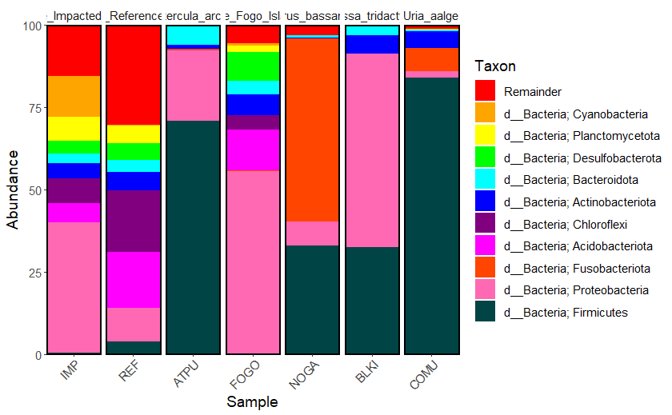
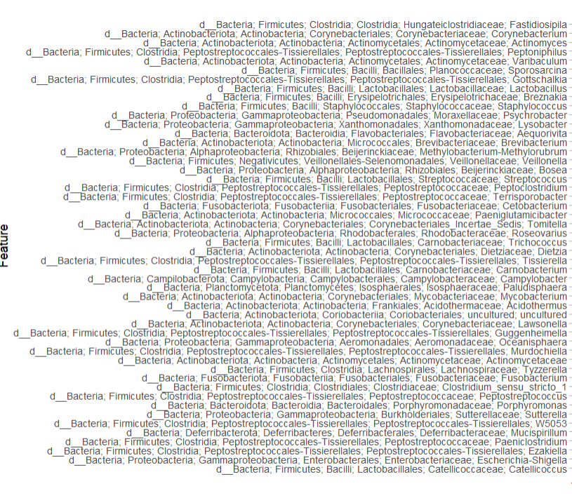
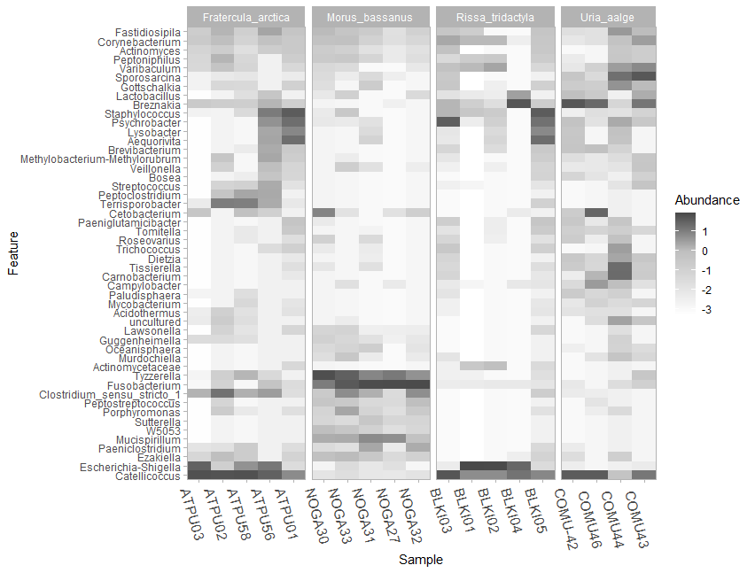
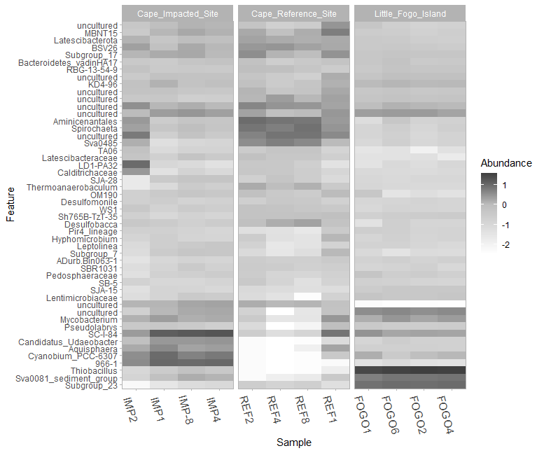
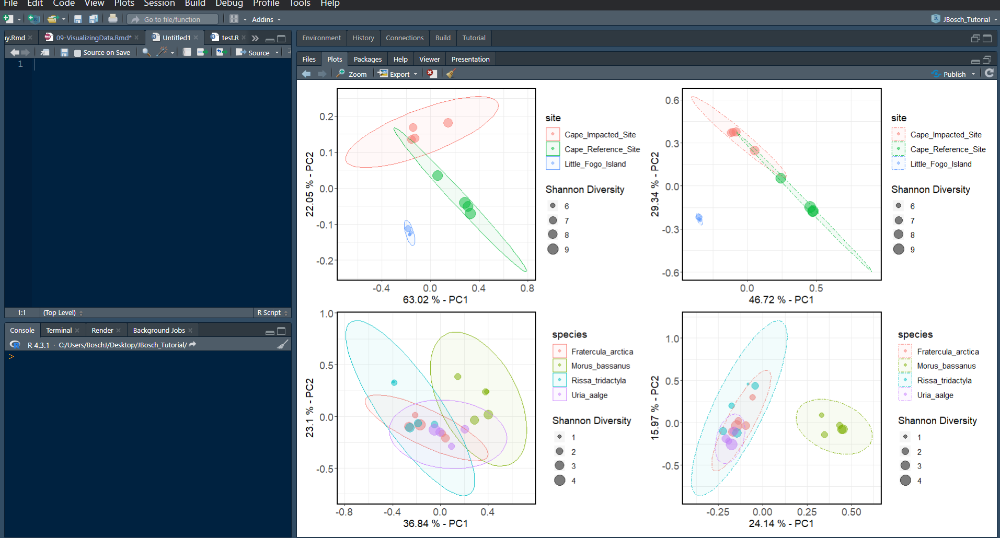
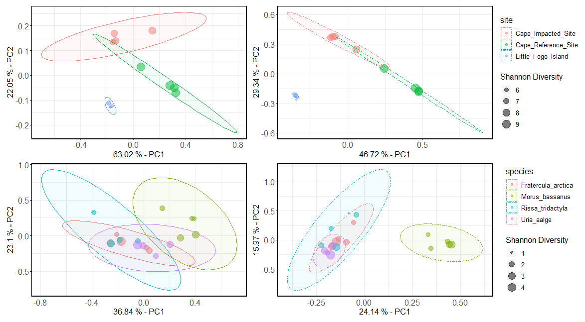
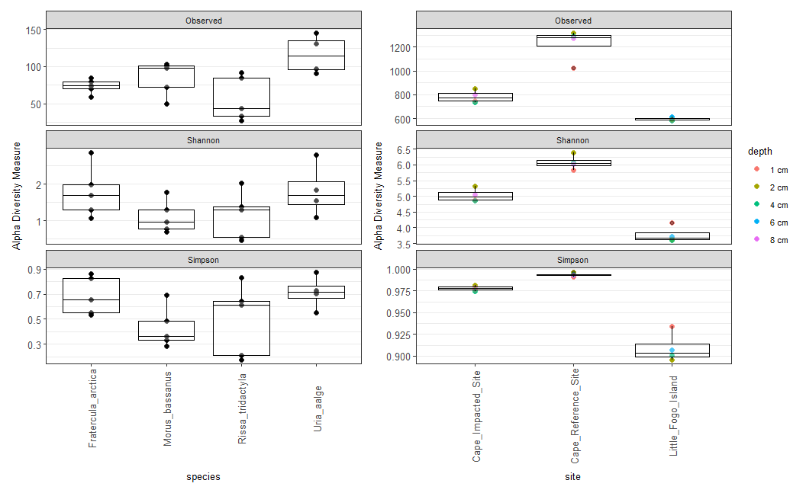

# **VISUALIZING TAXONOMIC DATA**

You can build lots of different charts through QIIME2 via the compute canada clusters, like we did with the diversity plots - but I think the QIIME2 plots are not as versatile as the ones that can be built in R. Here, I walk you through the steps of exporting the appropriate data to R to use several different packages that handle QIIME2 artifacts. The figures made in these next visualization sections can be saved as a vector file and then edited in other software such as Illustrator, Power Point, Libre Office, etc. for publishing.

If you're brand new to using R and RStudio, you should become familiar with the interface first. Here are a few links to get started

[REducation Beginners Tutorial](https://education.rstudio.com/learn/beginner/)

[Quantitative Guide for Biology: Intro to R](https://ahurford.github.io/quant-guide-all-courses/install.html)


## **Exporting data**

To begin making the figures, let's export the data on to a local computer from the cluster using the safe file transfer protocol (SFTP). You can return to **Chapter 03 - Importing Data** to review how the SFTP works.

I exported the following QZA files onto my local computer and kept them in a file called `Desktop/QIIME_files`. **Make sure to put these files into a dedicated folder for the remainder of the analysis so they are easy to find**

|File type | Associated file names |
|---------|----------------------------|
| Final feature table | final_table-sediments.qza, final_table-birds.qza, final_merged-table.qza |
| Representative sequences | rep-seqs_sediments.qza, rep-seqs_birds.qza, rep_seqs.qza |
| Classification files | classification_sediments.qza, classification_birds.qza, classification.qza|
| Phylogenetic tree | asvs-tree_sediments.qza, insertion-placements_sediments.qza, asvs-tree_birds.qza, insertion-placements_birds.qza, asvs-tree.qza, insertion-placements.qza|
| Merged feature table | merged-table.qza |
| Grouped feature table | grouped-table.qza | 
| Diversity folder for birds | includes all of the files from the `qiime core-metrics-phylogenetic` command run on the bird samples (put it into a folder named `/diversity-birds`)|
| Diversity folder for sediments | includes all of the files from the `qiime core-metrics-phylogenetic` command run on the sediment samples (put it into a folder named `/diversity-sediments`)|
| Diversity folder for merged files | includes all of the files from the `qiime core-metrics-phylogenetic` command run on the merged feature table (put it into a folder named `/diversity-merged`)|

## **Importing Q2 files to R**

A few different packages are used to load the QIIME2 artifacts into R. If you're new to R and haven't installed Rtools, do that first. RTools is a separate software that you have to download and install in your system (not in R). Follow this link to install RTools on your system - https://cran.rstudio.com/bin/windows/Rtools/. Sometimes you can get away without doing this step, it doesn't hurt to try!

Begin by installing and loading the following R packages. To install the qiime2R package, I used the remotes package because some versions of R will not allow you to install qiime2R through the normal `install.packages` method. 

```{r, eval=FALSE}
#install the ggforce and remotes package
install.packages("remotes")

#now load the remotes package
library(remotes)

#install qiime2R
remotes::install_github("jbisanz/qiime2R")

```

Now install and load some other packages that will be used in the downstream analysis

```{r, eval=FALSE}
install.packages("ggplot2")
install.packages("ggforce")
install.packages("tidyverse")
```

```{r, eval=FALSE}
#load the packages
library(ggplot2)
library(ggforce)
library(tidyverse)
```


## **QIIME2R**

[QIIME2R](https://github.com/jbisanz/qiime2R) is an R package that was created to manipulate QIIME2 artifact files for downstream analysis. It allows users to extract data from an artifact file, manipulate the data within the files, and create publication quality figures, including taxonomic bar charts, diversity plots, and more.


Start by setting your working directory, here I use the file `Desktop/QIIME-files`

```{r, eval=FALSE}
setwd("C:/Users/Hanna/Desktop/QIIME_files")

#check what files are in your wd
list.files()
```

To begin using QIIME2R, make sure the package is loaded first.

```{r, eval=FALSE}
library(qiime2R)
```


### Load the feature table

Next, read the feature tables in .QZA format that we will be using for the downstream analysis. Here I use the `<-` to assign the term `bird_features` to the file containing the feature counts for every bird sample (found in the folder QIIME-files in my Desktop folder).

```{r, eval=FALSE}
bird_features<- read_qza("final_table-birds.qza")
```

Once the data is read, you can view it using this command:

```{r, eval=FALSE}
view(bird_features$data)
```

Now do the same for the sediment samples and the grouped feature table that was made in Ch-06 (Data Preprocessing):

```{r, eval=FALSE}
sed_features <- read_qza("final_table-sediments.qza")
view(sed_features$data)

grouped_features <- read_qza("grouped-table.qza")
view(grouped_features$data)
```

To view if the information stored in the files is correct you can also use the`names` command:
```{r, eval=FALSE}
names(sed_features) #shows first 5 samples and first 5 taxa
names(bird_features)
```

One handy command to know is the `write.csv()` command, which can be used to create .csv file of your feature table.
```{r, eval=FALSE}
write.csv(bird_features$data, "feature-table_birds.csv")
```

### Load the metadata

Now that the feature table is loaded into R, the metadata can also be loaded. Always ensure that your metadata file is properly formatted.

If it's  unclear how metadata is used in this analysis, you should download the [metadata files](<https://github.com/johannabosch/QIIME2_for_Graham/blob/main>) titled `metadata.csv`, `birds_metadata.csv`, and `sediments_metadata.csv`. Take a look at the formatting of each file, and the type of data that's attached to each sample.

Metadata in microbiome analysis is akin to the footnotes in a research paper; while not essential for understanding the main text, it provides valuable information about the samples, such as site ID, sampling location, and species Latin names. This additional context enhances the comprehensibility and depth of taxonomic bar charts, diversity box plots, and other figures. The first column, labelled `#SampleID` is a special column header indicating the sample IDs, the other categories are the metadata. Each row represents a sample, with corresponding values for each metadata category. Remember that the specific metadata categories and their names can vary depending on your study and the information you want to associate with your samples. To learn more about using metadata in QIIME2, visit the [Metadata in QIIME2](https://docs.qiime2.org/2023.7/tutorials/metadata/#metadata-columns) page.

Load the metadata into R:
```{r, eval=FALSE}

#metadata file for only sediments
sediment_metadata<-read_q2metadata("metadata-sediments.csv")

#metadata file for only bird fecal samples
bird_metadata<-read_q2metadata("metadata-birds.csv")

#metadata file containing all the samples
metadata<-read_q2metadata("metadata.csv")

#metadata file containing all the grouped samples
#you do not have to use the QIIME2R's command, 
grouped_metadata<-read_q2metadata("metadata-grouped.csv")

head(metadata) #used to show top lines of a metadata file
```

### Load the taxonomic data

The next step to visualizing data using QIIME2R is to load the taxonomy data into R. This is done using the same `read_qza` command that was used before.

```{r, eval=FALSE}
taxonomy<-read_qza("classification.qza")

head(taxonomy$data) #used to see the first lines of the taxonomy data file

view(taxonomy$data) #used to open to taxonomy file in a new tab
```

### Parsing taxonomic data 

An important step that should be considered is parsing the `classification.qza` file to break up the taxonomic levels. This will separate each level of classification given to a feature. Here, the term `taxonomy` is being assigned to the part of the `classification.qza` file that contains the data (`taxonomy$data`). In other words, the term `taxonomy` now becomes the name of the variable where the parsed taxonomic data will be stored. `parse_taxonomy` is simply a function in the QIIME2R package specifically designed to extract taxonomic data from QIIME 2 artifacts. For example, a string of taxonomic classifications that looks like the first table shown here will end up looking like the second table:

**Table 1. Original taxonomic file:**
  
|FeatureID|Taxonomy|
|------|--------|
|4595dec6ed...| k__Bacteria;p__Firmicutes;c__Clostridia;o__Clostridiales;f__Lachnospiraceae;g__Roseburia;s__Roseburia intestinalis|


**Table 2. Parsed taxonomic data file:**
  
|FeatureID|Kingdom|Phylum|Class|Order|Family|Genus|Species|
|-------|--------|-------|--------|-------|-------|----------|
|4595dec6ed... | Bacteria | Firmicutes | Clostridia | Clostridiales | Lachnospiraceae | Roseburia | Roseburia intestinalis|


To parse the taxonomy file, use the following command:

```{r, eval=FALSE}

taxonomy<-parse_taxonomy(taxonomy$data)
view(taxonomy)

#save a .csv formatted version of the file if you want
write.csv(taxonomy, "taxa.csv") 

```

**NOTE:** when you do this, you will replace your original file assigned to the term `taxonomy` with the new parsed file that was also assigned to the term `taxonomy`. If you want to keep both files separate, you will have to change the term assigned to the parsed file to something like `parsed-taxonomy`.


### Create a taxa barplot

In this next section, I create a taxonomic bar chart which presents the top 10 most abundant phyla across all of my seabird and sediment samples together. This means that the resulting plot will show the top 10 most abundant phyla for every seabird species or sediment sampling site side by side. To do this we have to use the `grouped-table.qza` file that contains feature counts for both the sediment sampling sites and seabird species that was made in the last steps of Ch-06 (Data Preprocessing).

Make sure the following packages are loaded for this next section

```{r, eval=FALSE}
library(dplyr)
library(tidyr)
library(qiime2R)
```

Next, load the colors you'd like to use for your bar plot. This can be done in many different ways. You can always use a pre-made color palette that can be loaded through various R packages.

Let's try that first! Start by trying to load the RColorBrewer package and choosing the `Spectral` palette. Here I specify how many colors are needed for each sample group with `n=10`. 

```{r, eval=FALSE}
# method 1: loading a color palette 

install.packages("RColorBrewer")
library(RColorBrewer)
mycolors = c(brewer.pal(name="Spectral", n = 10), brewer.pal(name="BrBG", n = 10))
```

If you have more sampling groups than the color palette has colors, then this method will not work. You can also combine color palettes, but at that point I just prefer to specifiy the colors myself. And in many cases, assigning your own unique HEX codes to each group is really useful. In cases where you're working with a lot of different samples, you'll need the colors to be distinguishable from one another when sitting side by side in the barplot. By assigning your own colors to groups you can always go back and switch the order of colors in your plot.

```{r, eval=FALSE}
#method 2: assigning your own colors

colors <- c("#FF0000", "#FFA500", "#FFFF00", "#00FF00", "#00FFFF", "#0000FF", "#800080", "#FF00FF", "#FF4500", "#FF69B4", "#004445")

```

This next line of code specifies the dimensions of your plot, which is sometimes necessary for plots that are really large but may not necessary.

```{r, eval=FALSE}
par(mar=c(1000,1000,1000,1000))
```

Make sure the grouped-table.qza file (assigned to the term `grouped_features`) and the metadata.csv file (assigned to the term `metadata`) is loaded into R. Next, use the `summarize_taxa` command to summarize the taxonomy file by phylum. This line of code can also be used to summarize data by genera, or any other taxonomic level present in your parsed taxonomy file, simply change the term after the `$` in this code.

```{r, eval=FALSE}
taxasums <- summarize_taxa(grouped_features$data, taxonomy)$Phylum
```

Open this new `taxasums` file to see what happened here. This command merged the taxonomy file and the grouped feature table, and replaced the feature ID's with their associated taxa, meanwhile keeping the feature counts present for each group.

Now use this command to plot the bar graph. Here, I specify that the data should be plotted according to the `group` column in the file `metadata.csv`, and that 20 phyla should be plotted to the graph.

```{r, eval=FALSE}
taxa_barplot(taxasums, grouped_metadata, "group", ntoplot=10) +
  scale_fill_manual(values = colors) + #add colors we chose to the plot
  theme(text = element_text(size = 12)) + #add a theme to change font size
  guides(fill=FALSE) #remove this line if you want a legend

```


```{r fig1, fig.cap="Raw version of the taxa barplot showing the top 10 most abundant phyla present in each sampling group", echo=FALSE}

```

Save the figure as an .SVG file so that you can edit it in another software by ungrouping the single layer file. I like using LibreOffice Draw on Linux, or you can use PowerPoint, Illustrator, etc. If you don't know how to do this in your chosen software, Google it! 
```{r, eval=FALSE}
ggsave("taxa_birds.svg", height = 50, width = 100, units="cm")
```

If you'd like to know the exact feature counts used in this graph, create a .csv file here that contains all of the feature counts from the taxasums file
```{r, eval=FALSE}
write.csv(taxasums, "top-taxa-phyla.csv")
```

### Create a taxa heatmap

Now let's make two heatmaps that show the top 50 most abundant genera in (1) the sediment samples and (2) the seabird fecal samples. Taxonomic heatmaps that highlight the most abundant genera in your data set are important in microbiome studies because they provide a quick and visually intuitive way to identify the key microbial taxa driving differences between samples or experimental groups. These heat maps help researchers pinpoint which genera are significantly contributing to variations in microbial composition, aiding in the discovery of potential biomarkers or ecological patterns. Additionally, they simplify the complex data by focusing on the most relevant taxa, making it easier to interpret and communicate findings to a broader audience.

Here's a review on how to set up the data for the taxonomic heatmaps. If you're having trouble understanding some of these concepts, revisit the previous section on taxonomic bar plots for a more thorough review on the commands.

```{r, eval=FALSE}
#summarize the taxa based on genera for each sample type
taxasums_birds <-summarize_taxa(bird_features$data, taxonomy)$Genus
taxasums_sediments <-summarize_taxa(sed_features$data, taxonomy)$Genus

#check the new taxasums files 
view(taxasums_birds)
view(taxasums_sediments)

#save the files in .csv format for your analysis
write.csv(taxasums_birds, "taxa_counts_birds_genera.csv")
write.csv(taxasums_sediments, "taxa_counts_sediments_genera.csv")

#you can specify what metadata columns you want to use like this
species <- bird_metadata$species
site <- sediment_metadata$site

```

Now that we're all set up, let's create a taxonomic heatmap using the `taxa_heatmap` command for all of the seabird fecal samples. We start by using the summarized taxa file that was created above (`taxasums_birds`), and then specify the accompanying metadata file (`bird_metadata`) to be used, with the specific column we want to use for the x-axis of the heatmap (`species`). Next, we want to plot 50 taxa (`ntoplot=50`), and normalize the data with a `log10(percent)`, which emphasizes relative differences between taxa while reducing the influence of extreme values, making it easier to visualize patterns and compare abundance across taxa. Before running this command make sure you have enough space in your `Plots` quadrant on your screen has enough space to accommodate the heatmap. 

```{r, eval=FALSE}
taxa_heatmap(taxasums_birds, bird_metadata, "species", ntoplot=50, normalize = "log10(percent)") +
  scale_fill_gradient2(low="#9ac094", mid="#5ba14f", high="#003510", midpoint=0, na.value="white") +
    scale_y_discrete(labels = function(x) str_replace(x, ".*;", "")) +
  theme_light() + theme(axis.text.x = element_text(size = 12, angle =-75))
```

Make sure you have the `Plot` tab for the bottom right quadrant completely expanded to accommodate the size of the plot. After expanding the quadrant and running this code, you'll notice that the y-axis takes up most of the space on the plot. Here is what the y-axis labels look like right now:

```{r, echo=FALSE}

```

If you do not want to include the entire taxonomic lineage in the y-axis of the figure, you can simply add the `scale_y_discrete` argument to your command. This line of code modifies the y-axis labels of a discrete scale in a plot by removing everything before and including the last semicolon in each label using the str_replace function from the stringr package.

```{r, eval=FALSE}
taxa_heatmap(taxasums_birds, bird_metadata, "species", ntoplot=50, normalize = "log10(percent)") +
  scale_fill_gradient2(low="#9ac094", mid="#5ba14f", high="#003510", midpoint=0, na.value="white") +
  scale_y_discrete(labels = function(x) str_replace(x, ".*;", "")) +
  theme_light() + theme(axis.text.x = element_text(size = 12, angle =-75))
```

```{r fig2, fig.cap="Raw version of the taxa heatmap showing the top 50 most abundant genera present in each seabird fecal sampling group", echo=FALSE}

```

Let's do the same with the sediment samples:
```{r, eval=FALSE}
taxa_heatmap(taxasums_sediments, sediment_metadata, "site", ntoplot=50, normalize = "log10(percent)") +
  scale_fill_gradient2(low="#c99884", mid="#644133", high="#351b10", midpoint=0) +
  scale_y_discrete(labels = function(x) str_replace(x, ".*;", "")) +
  theme_light() + theme(axis.text.x = element_text(size=12, angle=-75))
```

```{r fig3, fig.cap="Raw version of the taxa heatmap showing the top 50 most abundant genera present in each sediment coring site group", echo=FALSE}

```


### Plot beta-diversity
PCA (Principal Component Analysis) plots are useful in microbiome analysis because they help visualize complex data by reducing it to a few key dimensions. In the context of comparing microbiomes between sites or species, PCA plots allow us to see patterns and similarities in microbial community composition, making it easier to identify which factors or variables are driving the differences in a data set.

While QIIME2 produces some nice interactive PCA plots, it's difficult to use these for publishing. With the QIIME2R package, you can create beautiful PCA plots and edit them to your liking. 

Start by assigning the term `species` and `site` to the appropriate column from your `metadata-birds.csv` and `metadata-sediments.csv` file:

```{r, eval=FALSE}
species <- bird_metadata$species
site <- sediment_metadata$site
```

After running the `qiime diversity core-metrics-phylogenetic` command in Ch07 (Diversity Analyses), two files called `unweighted_unifrac_pcoa_results.qza` and `weighted_unifrac_pcoa_results.qza` were produced for both the sediment and seabird fecal samples (4 files total). These are the files we will use to create the weighted and unweighted PCA plots.

> **NOTE:** Weighted UniFrac in PCA analysis takes into account the abundance of organisms, highlighting the influence of the most abundant species, while unweighted UniFrac focuses on presence and absence, emphasizing less abundant organisms in community comparisons.

Check that these files are in the appropriate `/diversity` folders within your working directory, go back to the **Exporting data** section of this chapter for a quick refresher. Start by loading these files into R, where `wunifrac` refers to the weighted PCA files, and `unwunifrac` refers to the unweighted PCA files:

```{r, eval=FALSE}
wunifrac_birds<-read_qza("diversity-birds/weighted_unifrac_pcoa_results.qza")

unwunifrac_birds<-read_qza("diversity-birds/unweighted_unifrac_pcoa_results.qza")

wunifrac_seds<-read_qza("diversity-sediments/weighted_unifrac_pcoa_results.qza")

unwunifrac_seds<-read_qza("diversity-sediments/unweighted_unifrac_pcoa_results.qza")

```

If you want to add a little extra addition to your PCA plots, you can integrate the shannon diversity metrics into the plot. The addition of the Shannon data (shannon) in this code allows you to include the Shannon Diversity Index as a size aesthetic in the PCA plot. By doing so, you can visualize how the diversity of microbial communities (as measured by Shannon Diversity) relates to the distribution of samples in the PCA space. This can help you explore whether samples with higher or lower Shannon diversity values cluster differently in the PCA plot, providing insights into the relationship between diversity and community composition. 

```{r, eval=FALSE}
# Shannon entropy data for sediment core samples
shannon_seds<-read_qza("diversity-sediments/shannon_vector.qza")$data %>% rownames_to_column("SampleID")

shannon_values_seds <- shannon_seds$shannon_entropy

# Shannon entropy data for seabird fecal samples
shannon_birds<-read_qza("diversity-birds/shannon_vector.qza")$data %>% rownames_to_column("SampleID")

shannon_values_birds <- shannon_birds$shannon_entropy

```

The next commands are used to plot the weighted (`PCA_w`) and unweighted (`PCA_unw`)PCA's of the sediment samples. This command can be broken down into several different parts that are explained below:

```{r, eval=FALSE}
#plotting weighted PCA for sediments

PCA_w_seds <- wunifrac_seds$data$Vectors %>%
  select(SampleID, PC1, PC2) %>%
  left_join(sediment_metadata) %>%
  left_join(shannon_seds) %>%
  ggplot(aes(x = PC1, y = PC2, color = site, size = shannon_values_seds)) +
  geom_point(alpha = 0.5) +
  stat_ellipse(type = "norm", level = 0.95, linetype = 1, geom = "polygon", aes(fill = site), alpha = 0.05) +
  theme_q2r() +
  theme(text = element_text(size = 12), panel.grid.major = element_line(), panel.grid.minor = element_line(), axis.text = element_text(size = 12)) +
  xlab(paste(round(100 * wunifrac_seds$data$ProportionExplained[1], 2), "% - PC1")) +
  ylab(paste(round(100 * wunifrac_seds$data$ProportionExplained[2], 2), "% - PC2")) +
  labs(size = "Shannon Diversity")


PCA_w_seds


#plotting unweighted PCA for sediments

PCA_unw_seds <- unwunifrac_seds$data$Vectors %>%
  select(SampleID, PC1, PC2) %>%
  left_join(sediment_metadata) %>%
  left_join(shannon_seds) %>%
  ggplot(aes(x = PC1, y = PC2, color = site, size = shannon_values_seds)) +
  geom_point(alpha = 0.5) +
  stat_ellipse(type = "norm", level = 0.95, linetype = 12, geom = "polygon", aes(fill = site), alpha = 0.05) +
  theme_q2r() +
  theme(text = element_text(size = 12), panel.grid.major = element_line(), panel.grid.minor = element_line(), axis.text = element_text(size = 12)) +
  xlab(paste(round(100 * unwunifrac_seds$data$ProportionExplained[1], 2), "% - PC1")) +
  ylab(paste(round(100 * unwunifrac_seds$data$ProportionExplained[2], 2), "% - PC2")) +
  labs(size = "Shannon Diversity")  # Set the legend title for size

PCA_unw_seds
```

Here is an explanation of some of the arguments in the PCA plotting command:

* `PCA_w_seds <- wunifrac_seds$data$Vectors %>%` : This part of the command selects the `Vectors` data from the `wunifrac_seds` object and begins a chain of operations.

* `select(SampleID, PC1, PC2) %>%` : selects three columns from the data: "SampleID," "PC1," and "PC2."

 *`left_join(sediment_metadata) %>%`: performs a left join with the data from `sediment_metadata`, combining the selected columns from the previous step with the  `SampleID` column.

* `left_join(shannon_seds) %>%` : similar to the previous step, performs a left join with the "shannon_seds" data, combining the result of the previous join with this data.

* `ggplot(aes(x = PC1, y = PC2, color = site, size = shannon_values_seds))` : This part starts creating a ggplot, where the `color` aesthetic is determined by `site`, and the `size` aesthetic is determined by `shannon_values_seds`.

* `stat_ellipse(type = "norm", level = 0.95, linetype = 1, geom = "polygon", aes(fill = site), alpha = 0.05)`: This adds ellipses to the plot that represent normal distribution-based confidence intervals (at 95% level) around the points. I chose linetype 1 for weighted PCAs and linetype 12 for unweighted PCAs.

* `xlab(paste(round(100 * wunifrac_seds$data$ProportionExplained[1], 2), "% - PC1"))` : Sets the x-axis label (and y-axis label in the next line) using the info from the "wunifrac_seds" object that denotes the proportion explained by the first principal component (PC1, or PC2 for the y-axis), converting it to a percentage.


Now plot the same for the seabird fecal samples:
```{r, eval=FALSE}
#plotting weighted PCA for seabird fecal samples

PCA_w_birds <- wunifrac_birds$data$Vectors %>%
  select(SampleID, PC1, PC2) %>%
  left_join(bird_metadata) %>%
  left_join(shannon_birds) %>%
  ggplot(aes(x = PC1, y = PC2, color = species, size = shannon_values_birds)) +
  geom_point(alpha = 0.5) +
  stat_ellipse(type = "norm", level = 0.95, linetype = 1, geom = "polygon", aes(fill = species), alpha = 0.05) +
  theme_q2r() +
  theme(text = element_text(size = 12), panel.grid.major = element_line(), panel.grid.minor = element_line(), axis.text = element_text(size = 12)) +
  xlab(paste(round(100 * wunifrac_birds$data$ProportionExplained[1], 2), "% - PC1")) +
  ylab(paste(round(100 * wunifrac_birds$data$ProportionExplained[2], 2), "% - PC2")) +
  labs(size = "Shannon Diversity")  # Set the legend title for size


PCA_w_birds


#plotting weighted PCA for seabird fecal samples

PCA_unw_birds <- unwunifrac_birds$data$Vectors %>%
  select(SampleID, PC1, PC2) %>%
  left_join(bird_metadata) %>%
  left_join(shannon_birds) %>%
  ggplot(aes(x = PC1, y = PC2, color = species, size = shannon_values_birds)) +
  geom_point(alpha = 0.5) +
  stat_ellipse(type = "norm", level = 0.95, linetype = 12, geom = "polygon", aes(fill = species), alpha = 0.05) +
  theme_q2r() +
  theme(text = element_text(size = 12), panel.grid.major = element_line(), panel.grid.minor = element_line(), axis.text = element_text(size = 12)) +
  xlab(paste(round(100 * unwunifrac_birds$data$ProportionExplained[1], 2), "% - PC1")) +
  ylab(paste(round(100 * unwunifrac_birds$data$ProportionExplained[2], 2), "% - PC2")) +
  labs(size = "Shannon Diversity")  # Set the legend title for size

PCA_unw_birds
```

Now that we have all 4 plots done for both unweighted and weighted metrics, lets put them all on the same figure using the `patchwork` package provided by R. 

```{r, eval=FALSE}
install.packages("patchwork")
library(patchwork)
wrap_plots(PCA_w_seds, PCA_unw_seds, PCA_w_birds, PCA_unw_birds)
```

Make sure you expand your bottom left quadrant in RStudio as much as possible to accommodate the plot size, as you can see in this screenshot. Your wrapped PCA figure will look something like this:
```{r, echo=FALSE}

```

You can see that we don't really need two legends for both unweighted and weighted versions of the same plot. Let's quickly fix the code to remove a legend from the two weighted plots to the left, so that all we have is legends to the right hand side of this figure by adding `legend.position="none"` to the `theme()` argument we already have going.

```{r, eval=FALSE}
# removing the legend for the sediment sample's weighted PCA

PCA_w_seds <- wunifrac_seds$data$Vectors %>%
  select(SampleID, PC1, PC2) %>%
  left_join(sediment_metadata) %>%
  left_join(shannon_seds) %>%
  ggplot(aes(x = PC1, y = PC2, color = site, size = shannon_values_seds)) +
  geom_point(alpha = 0.5) +
  stat_ellipse(type = "norm", level = 0.95, linetype = 1, geom = "polygon", aes(fill = site), alpha = 0.05) +
  theme_q2r() +
  theme(text = element_text(size = 12), panel.grid.major = element_line(), panel.grid.minor = element_line(), axis.text = element_text(size = 12), legend.position = "none") +
  xlab(paste(round(100 * wunifrac_seds$data$ProportionExplained[1], 2), "% - PC1")) +
  ylab(paste(round(100 * wunifrac_seds$data$ProportionExplained[2], 2), "% - PC2")) +
  labs(size = "Shannon Diversity")

# removing the legend for the seabird fecal sample's weighted PCA

PCA_w_birds <- wunifrac_birds$data$Vectors %>%
  select(SampleID, PC1, PC2) %>%
  left_join(bird_metadata) %>%
  left_join(shannon_birds) %>%
  ggplot(aes(x = PC1, y = PC2, color = species, size = shannon_values_birds)) +
  geom_point(alpha = 0.5) +
  stat_ellipse(type = "norm", level = 0.95, linetype = 1, geom = "polygon", aes(fill = species), alpha = 0.05) +
  theme_q2r() +
  theme(text = element_text(size = 12), panel.grid.major = element_line(), panel.grid.minor = element_line(), axis.text = element_text(size = 12), legend.position = "none") +
  xlab(paste(round(100 * wunifrac_birds$data$ProportionExplained[1], 2), "% - PC1")) +
  ylab(paste(round(100 * wunifrac_birds$data$ProportionExplained[2], 2), "% - PC2")) +
  labs(size = "Shannon Diversity")  # Set the legend title for size
```

Now wrap the plots one more time to see the final result!
```{r, eval=FALSE}
wrap_plots(PCA_w_seds, PCA_unw_seds, PCA_w_birds, PCA_unw_birds)
```

```{r fig4, fig.cap="Raw version of the weighted PCA (two left plots) and unweighted PCA (two right plots) for both sediment samples (top) and seabird fecal samples (bottom)", echo=FALSE}

```


## **Phyloseq**

[Phyloseq](https://joey711.github.io/phyloseq/) is a handy tool in microbiome analysis that helps researchers work with and visualize microbial community data **[19]**. It can be used alongside QIIME2 artifact files by converting QIIME2 outputs into a Phyloseq object. Like QIIME2R, it allows for advanced analysis, visualization, and exploration of microbiome data within R's programming environment.

install and load the needed packages
```{r, eval=FALSE}
install.packages("phyloseq")
library(phyloseq)
library(ggplot2)
library(tidyverse)
library(qiime2R)
```

### Build a phyloseq object

Next, create a phyloseq object for your data. These objects can contain several different .QZA files. In this case, they include the feature table, taxonomy file and metadata file, but they can also include the trees, insert-placements and other files which were created throughout the preprocessing and diversity analysis stages.

In these next commands, I build 2 phyloseq objects for (1) the seabird fecal samples, (2) the sediment samples. Make sure you are in the correct working directory, in this case `/QIIME_files`.

```{r, eval=FALSE}
#building an object for seabird fecal samples
birds_physeq<-qza_to_phyloseq(
  features="final_table-birds.qza",
  tree="asvs-tree_birds.qza","classification_birds.qza",
  metadata = "metadata-birds.csv")

birds_physeq

#building an object for sediment core samples
sediments_physeq<-qza_to_phyloseq(
  features="final_table-sediments.qza",
  tree="asvs-tree_sediments.qza","classification_sediments.qza",
  metadata = "metadata-sediments.csv")

sediments_physeq
```


### Taxonomic characteristics

If you want to find out how many taxa have been classified at different taxonomic levels within these objects, use the following commands:

```{r, eval=FALSE}
#for seabird fecal samples
tax_table(birds_physeq) %>%
  as("matrix") %>%
  as_tibble(rownames = "OTU") %>%
  gather("Rank", "Name", rank_names(birds_physeq)) %>%
  na.omit() %>% # remove rows with NA value
  group_by(Rank) %>%
  summarize(ntaxa = length(unique(Name))) %>% # computes number of unique taxa
  mutate(Rank = factor(Rank, rank_names(birds_physeq))) %>%
  arrange(Rank) 

#for sediment samples
tax_table(sediments_physeq) %>%
  as("matrix") %>%
  as_tibble(rownames = "OTU") %>%
  gather("Rank", "Name", rank_names(sediments_physeq)) %>%
  na.omit() %>%
  group_by(Rank) %>%
  summarize(ntaxa = length(unique(Name))) %>%
  mutate(Rank = factor(Rank, rank_names(sediments_physeq))) %>%
  arrange(Rank)
```

The above command takes the taxonomic table in the `birds_physeq` object and performs a series of data manipulation operations, using the dplyr and tidyr packages in R. It first converts the taxonomic table to a matrix, then converts it to a tibble with row names set as `OTU` (used as a generic term here even though I am using ASVs). It gathers the data to create two columns, `Rank` and `Name`, from the taxonomic ranks present in `birds_physeq`. The`na.omit()` line removes rows with missing values, and then `group_by()` line groups the data by `Rank`, then calculates the number of unique taxa for each rank using the `summarize()` command. Finally, the `mutate()` command converts `Rank` into a factor variable with predefined rank names, and finally arranges the data by `Rank` in ascending order using the `arrange()` command. The output for the command will look something like this (these numbers are from running the command on the sediment sample phyloseq object):

```{r, eval=FALSE}
# A tibble: 7 × 2
  Rank    ntaxa
  <fct>   <int>
1 Kingdom     2
2 Phylum     57
3 Class     125
4 Order     244
5 Family    309
6 Genus     393
7 Species   160
```

### Plot alpha-diversity
What's nice about Phyloseq is that you can calculate and plot diversity metrics all in one command, so you actually don't even have to run any qiime diversity commands if you don't want to! I like the plots that this Phyloseq package produces more anyways, and they are easier to save as an .SVG image to edit later on for publishing.

Here I plot three diversity metrics together for the sediment samples according to site, using the following `plot_richness` command:

```{r, eval=FALSE}
sediments_richness <- plot_richness(sediments_physeq, x = "site", color="depth", nrow=1, 
                                    measures = c("Simpson", "Shannon", "Observed")) +
  geom_point(size=2, alpha=0.5) +
  geom_boxplot(alpha=0.3, size=0.3, colour="black") +
  theme_bw()+
  theme(text = element_text(size = 10), panel.grid.major.x=element_line(FALSE), axis.text = element_text(size=10), axis.text.x=(element_text(angle=90, vjust=0.5)))
```

The above command includes metrics for Simpson, Shannon, and observed features as subplots. I assign the plot to the term  `sediments_richness` so that I can merge the diversity plots for both sediment and seabird samples together afterwards. Here is a quick review of the arguments I used here:

* `x="site"` will split the plot up into the 3 coring sites listed in the metadata file of the phyloseq object

* `color=depth` will color the points on the box plot so that diversity can be visualized across different depths of the core.

* The `nrow` argument let's you adjust the orientation of the plots, with 1 row the plots will end up in a horizontal line, with 3 rows the plots will end up in a vertical line.

* The `geom_points()` and `geom_boxplot()` arguments let you manipulate the size and transparency (alpha) of the box plot's features. 

> When adding a theme to boxplot, there are several options that you can choose from (to see a list of the themes visit [this link](https://ggplot2.tidyverse.org/reference/ggtheme.html)). I chose the black and white theme (`theme_bw()`) for my plot, and then on the last line I use the `theme()` argument to specify the overall text size of the boxplot and legend, as well as the axis text size.

* The `panel.grid.major.x=element_line(FALSE)` argument to removes the vertical grid lines as they aren't necessary here.

* The `panel.grid.major.y=element_line()` argument can also be used to specify the `color()`, `linetype()` and `size()` of your grid lines. 

* The `axis.text.x=(element_text(angle=90, vjust=0.5)` argument changes the orientation of the x-axis text so that it all fits better in the plot using the `angle` option, and the `vjust` option to adjust the vertical position of the labels so they are not overlapping the axis.


Next, do the same for the seabird fecal samples. This time plotting by species, without any colors for the points.

```{r, eval=FALSE}
birds_richness <- plot_richness(birds_physeq, x = "species", nrow=3, measures = c("Simpson", "Shannon", "Observed")) +
  geom_point(size=2, alpha=0.5) +
  geom_boxplot(alpha=0.3, size=0.3, colour="black") +
  theme_bw()+
  theme(text = element_text(size = 10), panel.grid.major.x=element_line(FALSE), axis.text = element_text(size=10), axis.text.x=(element_text(angle=90, vjust=0.5)))
```

Now we can make a larger plot for publishing that puts all of these plots together in one figure. You can always do this with plots using the `patchwork` package in R. 

```{r, eval=FALSE}
install.packages("patchwork")
library(patchwork)

wrap_plots(birds_richness, sediments_richness, nrow=1)
```

Your final box plot should look like this:
```{r fig5, fig.cap="Raw version of the taxa boxplot showing alpha-diversity metrics for seabird fecal samples (left) and sediment samples (right)", echo=FALSE}

```


If you want to use other diversity metrics for a plot like this, Phyloseq offers all of the following metrics:

* `Observed`: The number of distinct OTUs (Operational Taxonomic Units) or taxa observed in a sample, reflecting species richness.

* `Chao1`: An estimate of total species richness, taking into account both observed species and the number of rare or singleton species. It provides a more robust estimate of richness.

* `ACE` (Abundance-based Coverage Estimator): Similar to Chao1, it estimates total species richness while considering the abundance distribution of rare species. It is often used in cases where there are many rare species.

* `Shannon`: Measures both richness and evenness of species in a sample. Higher values indicate higher diversity, considering both species number and their relative abundances.

* `Simpson`: Focuses on the dominance of a few species in a sample. Lower values indicate higher diversity, with less dominance by a single species.

* `InvSimpson` (Inverse Simpson): Similar to Simpson but transformed to emphasize the dominance of species. Higher values indicate higher diversity.

* `Fisher`: A rarefaction-based diversity index that estimates species richness while considering the number of individuals sampled. It is sensitive to rare species and is used to compare diversity between samples with different sampling efforts.


___
&nbsp;
<hr />
<p style="text-align: center;">Github: [johannabosch](https://github.com/johannabosch) </a></p>
<p style="text-align: center;"><span style="color: #808080;"><em>yohannabosch@gmail.com</em></span></p>

<!-- Add icon library -->
<link rel="stylesheet" href="https://cdnjs.cloudflare.com/ajax/libs/font-awesome/4.7.0/css/font-awesome.min.css">

<!-- Add font awesome icons -->
<p style="text-align: center;">
    <a href="https://www.instagram.com/yohannabosch/" class="fa fa-instagram"></a>
    <a href="https://www.linkedin.com/in/yan-holtz-2477534a/" class="fa fa-linkedin"></a>
    <a href="https://github.com/johannabosch/" class="fa fa-github"></a>
</p>

&nbsp;